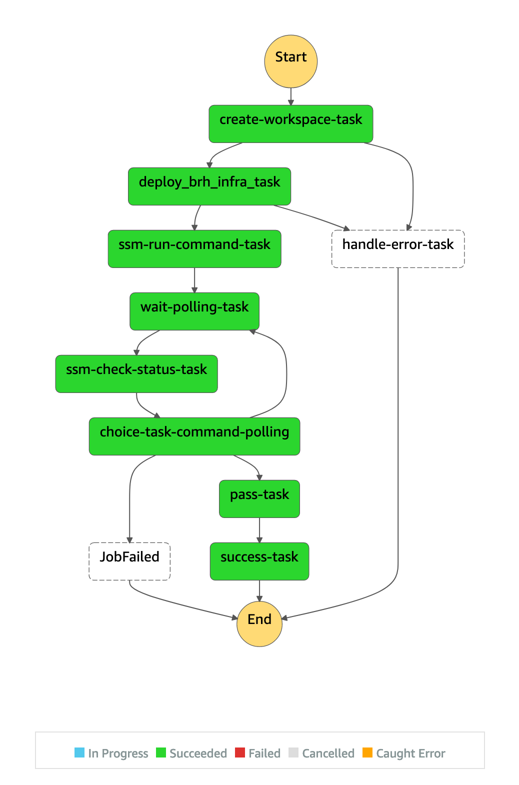

# BRH Admin Portal Backend
## Overview
The major components of the BRH Portal Backend are:
* REST API (API Gateway and Lambda)
* Persistent Storage (DynamoDB)
* Workspace Account Provisioning Step Functions Workflow

## Persistent Storage (DynamoDB)
The DynamoDB table created as part of the backend infrastructure relies on a Partition Key and a Sort Key. The Partition Key is the user_id (parsed from the JWT ID token under `.context.user.name`). The sort key is the bmh_workspace_id. This ID is an automatically generated UUID, created when a BMH workspace request is submitted. During this request, the other internal fields are automatically created:

* total-usage: Updated automatically by provisioned Workspace Accounts
* strides-credits: If the workspace type is STRIDES credits, this will include the default (or specified) credits amount.
* soft-limit/hard-limit: An SNS message will be sent to the SNS topic when the total-usage surpasses the soft-limit and the hard-limit.
* request_status: used to track the status of the request. The /provision endpoint on the /workspace resoruce will automatically update status.
* Other: Any other fields sent from the UI for the workspace request are also persisted in the database. 

### Global Secondary Index: bmh-workspace-index
A Global Secondary Index is provided which uses bmh_workspace_id as the Partition Key. Using this index will allow looking up User IDs based on BMH Workspace ID.

## REST API
### GET api/auth/get-tokens
* **Authorization**: Required, API Key.

* **Description** This request takes a `code` as a query string parameter and exchanges this code for user credentials with the configured auth service (OAuth) using the client id and client secret. Used by UI frontend.

### GET api/auth/refresh-tokens
* **Authorization**: Required, API Key
  
* **Description**: Takes a refresh token and exchanges it for a new ID Token from the configured Auth service (OAuth).

### POST api/workspaces
* **Authorziation**: Required, valid JWT token.

* **Description:** Currently, it performs the following steps:
  1. Assigns a unique workspace request ID and sends provided information to configured email for workspace request account creation.
  
* **Request:** Body should be a json encoded object of key value attributes. The only required parameter in the body is `workspace_type`, which should have one of the following values: "STRIDES Credits", or "STRIDES Grant". All other attributes provided in the body json will be stored in the database.

* **Response:** Will return status code 200 and body: {"message":"success"} on success, 401 if invalid token was provided, or 50X if an internal error occurred.

### GET api/workspaces
* **Authorziation**: Required, valid JWT Token

* **Description:** This request will return a list of Workspaces from DynamoDB which are associated with the provided email address.

* **Response:** Returns some attributes used as input for the POST api/workspaces called. Will only return the Workspaces associated with the authenticated user. If no workspaces are found associated with the user, will return a status code of 204. *Note* This API Endpoint will only return a subset of values which are required for the UI to render the workspaces table (as seen below). If other values are present in the DynamoDB table, they will be omittied. Example response data structure:

      [{
          "total-usage": 216.73,
          "strides-credits": 250,
          "hard-limit": 225,
          "user_id": "researcher@university.edu",
          "bmh_workspace_id": "2bbdfd3b-b402-47a2-b244-b0b053dde101",
          "soft-limit": 150,
          "total-usage": 7.43,
          "request_status": "active",
          "workspace_type": "STRIDES Credits",
          "nih_funded_award_number": "4325534543"
      },
      ....
      ]

### GET api/workspaces/{workspace_id}
* **Authorziation**: Required, valid JWT token

* **Description:** This request will return a single workspace representation (see above), if a resource exists with the specified workspace_id. 

* **Response:** Will return a single representation of a workspace. Otherwise, will return status code 404 if no workspace with the given ID can be found.

      {
          "total-usage": 216.73,
          "strides-credits": 250,
          "hard-limit": 225,
          "user_id": "researcher@university.edu",
          "bmh_workspace_id": "2bbdfd3b-b402-47a2-b244-b0b053dde101",
          "soft-limit": 150,
          "total-usage": 7.43,
          "request_status": "active",
          "workspace_type": "STRIDES Credits",
          "nih_funded_award_number": "4325534543"
      }

### POST api/workspaces/{workspace_id}/provision
* **Authorization**: Required, API Key
* **Description**: Will begin the provisioning process for a BRH Workspace.
  1. Create account specific API Key and SNS topic.
  2. Store status in database.
  3. Start step functions workflow (OCC/DDI Lambda, BRH Provision Lambda, etc).

* **Response**: Status code 200 on success. Body: {"message":"success"}

### PUT api/workspaces/{workspace_id}/limits
* **Authorziation**: Required, API Key

* **Description:** Used to set the hard and soft cost and usage limits of a single workspace. Separate endpoints for hard or soft limits do not exist. Stores new values in the DynamoDB table.

* **Request:**
  
      {
          "soft-limit": 2500,
          "hard-limit": 4750
      }

* **Response:** Returns a full representation of the workspace (see above) with the new values for hard and soft limits. 404 if the workspace was not found.

### PUT api/workspaces/{workspace_id}/total-usage
* **Authorization**: Valid API Key (associated with Workspace Account)

* **Description:** Used by the workspace account to automatically set total cost and usage of that account. This method will store that information to the DynamoDB table. This will also publish a method to the configured SNS topic alerting if the current total cost and usage exceeds either of the limits. This should only happen when the old total cost and usage is less than the limit, and the new cost and usage is greater than the limit.

* **Request:**

      {
          "total-usage": 234.84
      }

* **Response:** Will return 200 status code on success (with empty body '{}'). 

## Step Functions (Provisioning Workflow)

1. create-workspace-task: OCC/DDI lambda function used to baseline a new account.
2. deploy_brh_infra_task: Uses the cross account role specified in backend config to deploy the BRH CloudFormation template found in `bmh_workspace/templates/BMHAccountBaseline.yml`. 
3. ssm-run-command-task: This is an example of an SSM task which is started from the Step Function state machine. This can be configured to automatically run tasks on the AdminVM which are configured in SSM.
4. wait-polling-task, ssm-check-status-task, choice-task-command-polling: These steps monitor the running SSM task until it has completed. Then it will set the state machine status to success or failure depending on the result.

During deployment, the CDK application will have created an SNS topic where status notifications will be sent during the BRH Workspace provisioning process (success and failure). You can subscribe to the topic from the AWS Console with whichever email(s) should receive these notifications. ([SNS - AWS Console](https://console.aws.amazon.com/sns/v3/home?region=us-east-1#/dashboard)). The Topic should be named similarly to `bmh-admin-portal-backend-stepfntopic<UNIQUEID>`.

## Misc
### Receiving Emails via SES
The `/provision` endpoint on the `/workspace` resource will generate a unique email address which is sent with the workspace request via email. This is intended to be used as the root account email address for the newly provisioned AWS account. In order to receive these emails, you can setup SES to receive emails on your behalf. This process is described in detail in the [AWS Docs](https://docs.aws.amazon.com/ses/latest/DeveloperGuide/receiving-email.html) and in brief below:

1. Verify your email domain (follow the instructions [here](https://docs.aws.amazon.com/ses/latest/DeveloperGuide/verify-domain-procedure.html))
2. Ensure your mx records are correctly configured for the domain (for domains registered with Route53, tested with the MX record set to inbound-smtp.us-east-1.amazonaws.com). *Note* SMTP inbound enpoints only exist in us-east-1, us-west-2 and eu-west-1 at the moment. For up-to-date information see [this page](https://docs.aws.amazon.com/ses/latest/DeveloperGuide/regions.html#region-endpoints)
3. Setup a receipt rule. You can setup all emails to be written to S3 and setup SNS notifications when a new email is received. 
4. Send a test email to ensure everything is configured correctly.

### Adding SSM Run Commands to Step Functions Workflow
To add a run command SSM capability to the Provisioning Workflow, look at the current .bmh_admin_portal_backend.brh_provisioning.base_workflow. This module demonstrates adding a simple run command.

The run command is actually deployed from the step_functions_handler lambda function. If parameters need to be included in the run command, they can be pulled from the Step Functions input (see example in `lambda.step_functions_handler.src.handlers.ssm_run_command_handler.py`)

**Note:** Before the run command will work on a specific EC2 Instance, please ensure:
1. The EC2 has the correct permissions to be managed by SSM (i.e. by adding the mananged policy `AmazonSSMManagedInstanceCore` to the instance profile). See the [docs](https://docs.aws.amazon.com/systems-manager/latest/userguide/setup-instance-profile.html) for more detailed information. This isn't necessary if the EC2 instance has Admin privileges associated with the Instace Project (although, this should be avoided if possible).
2. The VM is running an instance of SSM Agent running. For instructions on how to deploy this on Ubuntu, see the [docs](https://docs.aws.amazon.com/systems-manager/latest/userguide/agent-install-ubuntu.html)
